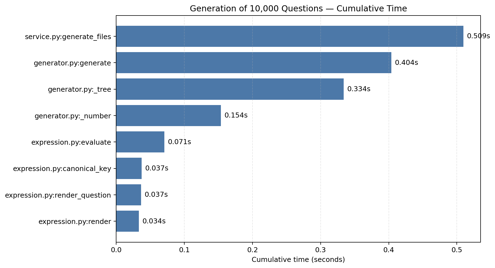

# 结对项目：小学四则运算题目生成器

> 姓名与学号：伍俊霖 / 3124004183、曾毓彬 / 3124004188  
> GitHub 地址：https://github.com/wujunlin6666/3124004183/tree/master/pair-arithmetic-quiz

## 一、PSP2.1

本表按两人的结对开发过程统计。预估总耗时为 810 分钟，实际总耗时为 765 分钟。

| PSP2.1 | Personal Software Process Stages | 预估耗时（分钟） | 实际耗时（分钟） |
|---|---|---:|---:|
| Planning | 计划 | 30 | 35 |
| · Estimate | · 估计任务总时间 | 30 | 35 |
| Development | 开发 | 600 | 555 |
| · Analysis | · 需求分析与学习 | 60 | 55 |
| · Design Spec | · 生成设计文档 | 45 | 40 |
| · Design Review | · 设计复审 | 30 | 25 |
| · Coding Standard | · 制定代码规范 | 20 | 20 |
| · Design | · 具体设计 | 70 | 65 |
| · Coding | · 具体编码 | 250 | 220 |
| · Code Review | · 代码复审 | 45 | 50 |
| · Test | · 测试与修改 | 80 | 80 |
| Reporting | 报告 | 180 | 175 |
| · Test Report | · 测试报告 | 60 | 55 |
| · Size Measurement | · 工作量统计 | 30 | 25 |
| · Postmortem & Process Improvement Plan | · 事后总结与改进 | 90 | 95 |
| 合计 |  | 810 | 765 |

## 二、需求分析

列出生成模式、批改模式、范围约束、子表达式约束、运算符数量、重复定义和 10000 题性能要求。特别说明本项目把“除法结果为真分数”实现为严格满足 `0 < 结果 < 1`。

## 三、设计与实现

### 3.1 模块划分

结合 `README.md` 介绍 `expression`、`generator`、`parser`、`service`、`cli` 五个模块。可画出下面的关系：命令行 → 服务层 → 生成器/解析器 → 表达式树。

### 3.2 关键算法

1. 用 `Fraction` 精确计算，避免浮点误差。
2. 用表达式树保存括号和运算顺序。
3. 减法生成时保证左子树值不小于右子树值。
4. 除法生成时保证 `0 < 左值 < 右值`。
5. `+` 和 `×` 节点递归排序规范键，实现题目定义的去重。

粘贴少量关键代码并逐段解释，不要把整个项目源码全部贴进博客。

## 四、效能分析

本次测试环境为 Windows、Python 3.13。运行 `python scripts/profile_generation.py`，使用 cProfile 对生成 10000 道题的完整过程进行分析。实测共调用 2,086,459 次函数，其中 2,001,279 次为原始调用，总耗时 0.509 秒。

从累计耗时看，`generate_files()` 为 0.509 秒，生成器的 `generate()` 为 0.404 秒，递归构建表达式树的 `_tree()` 为 0.334 秒，随机产生操作数的 `_number()` 为 0.154 秒。因此主要开销来自随机表达式树的构造、求值和唯一性检查，而文件写入并不是主要瓶颈。

性能优化思路是为每棵表达式树计算不可变的规范键，并使用 `set` 保存已生成的键。这样判断重复题的平均时间复杂度为 O(1)，避免每生成一道题都与此前所有题目逐一比较。生成 10000 道题仍能在一秒内完成，满足作业要求。性能分析与优化实际耗时为 35 分钟。

## 五、测试运行

至少展示以下 10 类测试，并附自动测试截图：

1. 自然数格式化。
2. 真分数格式化。
3. 带分数格式化与解析。
4. 乘除优先级。
5. 括号优先级。
6. 减法所有子表达式均不产生负数。
7. 除法所有子表达式结果均为真分数。
8. 每题不超过三个运算符。
9. 交换律重复题能够被识别。
10. 10000 道题生成成功且数量正确。
11. 全对、部分错误、缺少答案等批改场景。

解释正确性的依据：固定随机种子批量生成并遍历每棵表达式树检查不变量；解析和格式化分别做边界测试；文件功能使用临时目录隔离验证。

## 六、运行结果

展示生成 10 题、生成 10000 题、批改答案以及参数错误帮助信息的终端截图。

## 七、结对过程与项目小结

两人分别写清真实分工、结对方式、遇到的问题、解决过程和收获。最后分别写对方的闪光点和一条具体、友善、可执行的建议，避免空泛表述。
